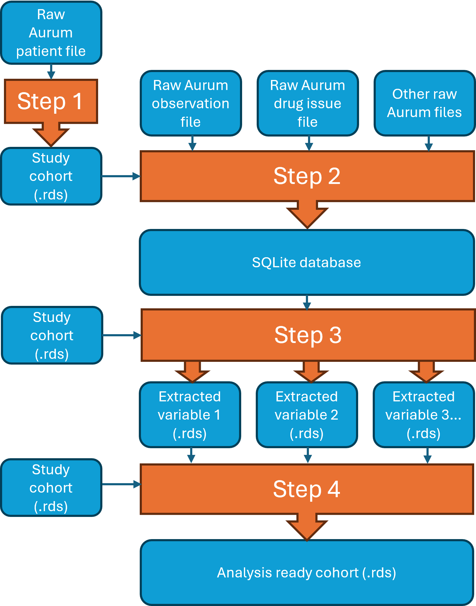
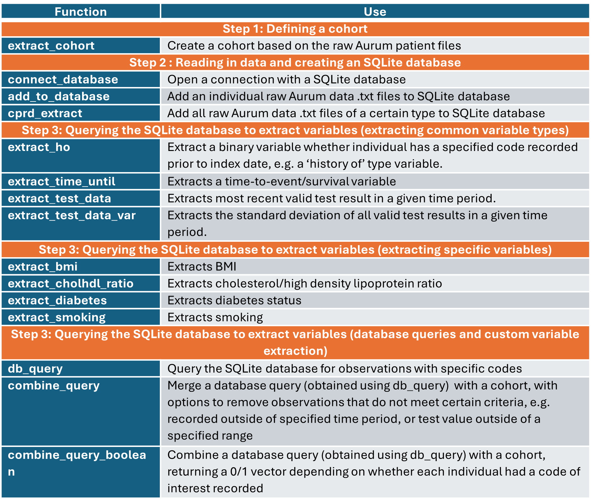

```{r, include = FALSE}
knitr::opts_chunk$set(
  collapse = TRUE,
  comment = "#>"
)
```

*This article does not contain any real patient data. All patient data has been simulated but formatted to match the structure of CPRD Aurum data.*

# Introduction

The Clinical Practice Research Datalink (CPRD) is a large resource of Electronic Health Records from the UK, owned by the UK Medicines and Healthcare products Regulatory Agency (MHRA), and containing information on demography, medical history, test results and drug use of individuals registered with a general practice. The MHRA maintain two databases, CPRD GOLD [@Herrett2015] which contains data from general practices using the Vision computer system, and CPRD Aurum [@Wolf2019], which contains data from general practices using the Egton Medical Information Systems (EMIS) computer system, EMIS Web. The primary care data is linked to hospital data, death registration data, cancer registry data, deprivation data and mental health services data, enabled by NHS digital.[@Padmanabhan2019] As of 2016, the EMIS Web computer system was used by 4199 (56%) of the general practices in England.[@Kontopantelis2018] As of June 2024, CPRD Aurum contained data on 47 million (16 million currently registered) individuals from 1,784 (1,596 currently contributing) general practices across the United Kingdom.[@CPRD2024] CPRD is a widely used resource. Since 2019, using the PubMed library, there have been 540 studies published which contain “CPRD” in the title or abstract. Extraction and transformation of CPRD data into an analysable format is a computationally demanding process and requires a significant amount of work. Despite this, there is only a few pieces of software available to aid researchers in the extraction and processing of CPRD data.[@Springate2017, @TheHealthFoundationAnalyticsLab2021, @Yimer2021]

**rEHR** [@Springate2017] is an R package for manipulating and analysing electronic health record data, which works by creating an SQLite database on a fixed storage device (i.e. a disk drive), which is then subsequently queried to extract relevant information, faster than with conventional statistical analysis software. **rEHR** was designed to be database agnostic, and contains functionality for longitudinal data extraction, cutting data by time-varying covariates, matching controls to cases, converting the units of test data, and creating clinical code lists. **rEHR** is however no longer maintained. It works with an older version of R (3.3.2) and has been archived on CRAN. The **aurumpipeline** package [@TheHealthFoundationAnalyticsLab2021] contains functions to clean and process CPRD Aurum data, which works by storing the data as parquet files on the disk drive, which are then subsequently queried to extract relevant data. However, **aurumpipeline** is not available on CRAN and is not provided with any reproducible examples. The R package **drugprepr** [@Yimer2021] implements the algorithm of @Pye2018 for preparing drug exposure data extracted from CPRD, however it does not deal with the initial data extraction and storing of data.

Given the large number of studies using CPRD data, and the limited availability software for data processing, this indicates that a large amount of research time is being spent duplicating the work of others in order to extract CPRD data. This study introduces **rAURUM**, an R package designed to assist researchers in working with CPRD Aurum data and creating datasets which are 'analysis-ready'. The main problem when working with CPRD Aurum data is the size of the raw data. Data on over 47 million individuals results in thousands of raw .txt files, and Terabytes of data, which can be cumbersome to work with. This is a particular issue for R users, as its unfeasible to read all this data into the R workspace simultaneously, as R operates using physical memory (RAM). As suggested by @Springate2017, **rAURUM** bypassess this problem by creating an SQLite database which can be saved onto a fixed storage device. This SQLite database can then be queried for data of interest in order to build an analysis-ready dataset. **rAURUM** then simplifies the process of querying the SQLite database with functions to extract variables such as "most recent test result", "time until first event", or "history of a specified condition".

We start by discussing the structure of CPRD Aurum data and the approach taken by **rAURUM** for processing this data, which draws heavily on the work of @Springate2017. We then run through a worked example to showcase the functionality of **rAURUM**, which has two main groups of functions. The first are to extract and store the data in a consistent manner. The second group is to query this data to extract patient level variables. We focus on CPRD Aurum, as opposed to CPRD GOLD, given there has been a considerable drop in the number of practices utilising Vision software in the last 10 years, limiting the research utility of the CPRD GOLD database. However, this package can also be used to manage linked secondary care (HES) and ONS death data, and is flexible to the point that it could be used to extract and store data from any electronic health record, which will be touched on in the discussion.

# Data Structure and Extraction Process

## Structure of CPRD Aurum data

We first define the terminology which will be used throughout this article. *Raw data*: The raw data provided to the user by CPRD. *Cohort*: A cohort of individuals that meet the inclusion/exclusion criteria for a given research question. In this setting, the cohort is ultimately a vector of patient id’s. *Analysis-ready dataset*: A data frame to which statistical models can be fitted, with one row for each individual in the cohort, and a column for each variable of interest, for example, age at cohort entry, or most recent BMI score prior to cohort entry. For longitudinal analyses, such data frames can be concatenated, with a variable indicating the time point at which the data was extracted.

The raw data is split into eight different file types: Consultation, DrugIssue, Observation, Patient, Practice, Problem, Referral, Staff. The data specification is available here: [@ClinicalPracticeResearchDatalink2022]. For most research questions, the relevant files are Patient, Observation and DrugIssue. The Patient file contains information about registration into the database, date of death or lost to follow up, year of birth and gender. This file will be required to define a cohort. The observation file contains all medical diagnoses and tests, while drugissue contains information on prescriptions. Medical observations are identified by their *medcodeid*, whereas prescriptions are identified through their *prodcodeid*.

In order to facilitate data transfer, this data is commonly split by CPRD into numerous smaller files. The different patient files are denoted by the string *set1*, *set2*, *set3* in the file name. Individuals in the same patient file will have the corresponding string (*setX*) in the files containing their medical or prescription data. However, there will be more than one Observation and DrugIssue file corresponding to each patient file. For example, the observation files for patients in *set1*, will have *set1* in their file name, and then an extra suffix 1, 2, 3, etc. The same is true for the DrugIssue files. The naming structure for these is as follows:

- aurum_allpatid_set$X$_extract_patient_001.txt
- aurum_allpatid_set$X$_extract_observation_0$Y$.txt
- aurum_allpatid_set$X$_extract_drugissue_0$Y$.txt

where $X\in{1,2,3,...}$ and $Y\in{01,02,03,...}$. Note that the prefix to the file names may vary (i.e. the 'aurum_allpatid' part) however we expect the naming convention with regards to 'set$X$', file type, and '0$Y$' to remain consistent. If this changes in the future, we will endeavour to update the **rAURUM** as soon as possible. 

## Recommended process for extraction

Our recommended process for developing an analysis-ready dataset is as follows (see Figure 1 for a visual representation of this):

* Step 1: Define cohort of interest by applying inclusion/exclusion criteria.
* Step 2: Read raw data for individuals in the cohort of interest into R, and write this data into an SQLite database.
* Step 3: Query this SQLite database for specific codes and tests to create variables for each individual in the cohort. These are stored as .rds objects, which R data analysts will be familiar with.
* Step 4: Combine extracted variables into an analysis-ready dataset, also stored as an .rds object.

```{r, echo = FALSE, out.width = "100%", fig.cap = "Figure 1: Flowchart for recommended data extraction process. Blue boxes denoate data files. Orange boxes denote application of rAURUM functions."}
#{width = 100%}

```

The process can be done entirely from within R using rAURUM functions, without any specialist understanding of SQLite databases required.We recommend this process because once set up, querying the SQLite database is computationally much quicker than reading each of the raw files into the R workspace and querying these separately. It also reduces the probability of errors induced from creating numerous loops through the raw data files. We now move onto a worked example, where we showcase how to implement the above process using **rAURUM** and the functions which are detailed in Table 1.

```{r, echo = FALSE, out.width = "100%", fig.cap = "Table 1: Table of rAURUM functions"}
#{width = 100%}

```

# Worked example for data extraction

## Step 1: Defining a cohort

We have provided simulated patient, observation and drugissue files which will be utilisied in the worked example. The names of the files share the same naming convention given in section 2.1, and column names of the data match the real Aurum data. Numeric variables were simulated at random as integers between 1 and 100, date variables as a date between 01/01/1900 and 01/01/2000, gender as an integer 1 or 2, and year of birth as an integer between 1900 and 2000. Patient id and practice id were assigned manually. These files are contained in the *inst/aurum_data* directory of **rAURUM**. After installing **rAURUM**, this directory can be accessed using the command `system.file("aurum_data", package = "rAURUM")`. This contains data on 12 fake patients, split across two patient files (*set1* and *set2*) and three observation and drugissue files (all *set1*):

```{r}
#devtools::install_github("alexpate30/rAURUM")
#install.packages("rAURUM") NOT YET ON CRAN
library(rAURUM)
list.files(system.file("aurum_data", package = "rAURUM"), pattern = ".txt")
```

The first step in most analyses is creating and defining a cohort of individuals, which will involve working with the patient files. Data from the patient files can be combined using the `extract_cohort` function. This will look in the directory specified through the `filepath` argument, for any file containing "patient" in the file name. All files will be read in and concatenated into a single dataset. In some circumstances, researchers may be provided with a list of patids which meet their inclusion/exclusion criteria. In this case, these can be specified through the `patids` argument (which requires a character vector). Suppose the individuals meeting the exclusion criteria are those with patid = 1, 3, 4 and 6. We would then specify:

```{r}
pat <- extract_cohort(filepath = system.file("aurum_data", package = "rAURUM"), patids = as.character(c(1,3,4,6)))
str(pat)
```

In other circumstances, a user may need to apply the inclusion and exclusion criteria themselves. In this case, one would initially create a patient file for all individuals.

```{r}
pat <- extract_cohort(filepath = system.file("aurum_data", package = "rAURUM"))
str(pat)
```

The cohort of individuals would then be defined by applying study specific inclusion/exclusion criteria. For example, all individuals with > 1 day valid follow up aged 65+, after 1st January 2000. Such criteria can be applied solely using the information available in patient files. In this example, we define the individuals that met the inclusion criteria to be those with patid = 1, 3, 4 and 6. 

```{r}
pat <- subset(pat, patid %in% c(1,3,4,6))
```

Once the cohort has been defined, the next step is to extract medical/prescription data for these individuals. However, it is also common for inclusion/exclusion criteria to be dependent on medical diagnoses and prescription history. For example, an additional inclusion criterion, that individuals must have a diagnosis of type 2 diabetes. To apply this criterion and reduce the cohort further, a user must first extract medical history data for the cohort. In this case, the steps outlined in section 2.2 may be altered to:

* Step 1: Define cohort of interest by applying inclusion/exclusion criteria that are not dependent on medical history.
* Step 2: Read medical/prescription data for cohort of interest into R and write into an SQLite database.
* Step 2.2: Query this SQLite database for specific codes and tests to apply remaining inclusion/exclusion criteria that are dependent on medical history.
* Step 2.3: [Optional] Reduce SQLite database to only contain data on individuals in final cohort. This may be worthwhile if the inclusion/exclusion criteria in step 3 excluded a large number of individuals. This will mean future queries into the SQLite database will run much quicker.
* Step 3: Query this SQLite database for specific codes and tests to create variables for each individual in the cohort.
* Step 4: Combine extracted variables into an analysis-ready dataset.

## Step 2: Reading in data and creating an SQLite database

Data for individuals in the cohort of interest is extracted from the .txt files and put into a SQLite database. This SQLite database is stored on a fixed storage device and can be queried when defining an analysis-ready dataset.

### Add individual files to SQLite database using `add_to_database`

The function `add_to_database` can be used to add individual files to the SQLite database. Start by defining and connecting to your SQLite database. In this article we create a temporary database, but in practice this would be a permanent storage location. Specifically, `tempfile("temp.sqlite")` would be replaced by the desired file path and SQLite database name.

```{r}
aurum_extract <- connect_database(tempfile("temp.sqlite"))
```

Next, we add medical diagnoses data from the observation files to this database using the `add_to_database` function. The simulated raw data provided with **rAURUM** can be accessed using the `system.file` function. The vector of patient id's that defines the cohort is defined through the `subset.patids` argument. Only data with patid's matching this argument will be added to the SQLite database. The `filetype` argument will select an appropriate function for reading in the .txt files, and also defines the name of the table in the SQLite database that the files are added to. Note that for the first file, `overwrite = TRUE` is specified to create a new table. For the second and third file, `append = TRUE` is specified to append to an existing table.

```{r}
add_to_database(filepath = system.file("aurum_data", "aurum_allpatid_set1_extract_observation_001.txt", package = "rAURUM"), 
                filetype = "observation", subset.patids = c(1,3,4,6), db = aurum_extract, overwrite = TRUE)
add_to_database(filepath = system.file("aurum_data", "aurum_allpatid_set1_extract_observation_001.txt", package = "rAURUM"), 
                filetype = "observation", subset.patids = c(1,3,4,6), db = aurum_extract, append = TRUE)
add_to_database(filepath = system.file("aurum_data", "aurum_allpatid_set1_extract_observation_001.txt", package = "rAURUM"), 
                filetype = "observation", subset.patids = c(1,3,4,6), db = aurum_extract, append = TRUE)
```

We can then query this database, by selecting all rows from the *observation* table, and only printing the first 3. More details on how to query an SQLite database from within R is available in the documentation for R package RSQLite [@Muller2024].

```{r}
RSQLite::dbGetQuery(aurum_extract, 'SELECT * FROM observation', n = 3)
```

Note that when reading the raw data into R, the dates are converted into date formats, with a underlying numeric value where day 0 is 01/01/1970. When saved to the SQLite database, it is the underlying numeric values which is saved, hence the dates now appearing as numeric values. Next, the prescription data from the drugissue files is added to a table called `drugissue`. A single SQLite database may contain more than one table, so this data is added to a different table within the same SQLite database.

```{r}
add_to_database(filepath = system.file("aurum_data", "aurum_allpatid_set1_extract_drugissue_001.txt", package = "rAURUM"), 
                filetype = "drugissue", subset.patids = c(1,3,4,6), db = aurum_extract, overwrite = TRUE)
add_to_database(filepath = system.file("aurum_data", "aurum_allpatid_set1_extract_drugissue_001.txt", package = "rAURUM"), 
                filetype = "drugissue", subset.patids = c(1,3,4,6), db = aurum_extract, append = TRUE)
add_to_database(filepath = system.file("aurum_data", "aurum_allpatid_set1_extract_drugissue_001.txt", package = "rAURUM"), 
                filetype = "drugissue", subset.patids = c(1,3,4,6), db = aurum_extract, append = TRUE)
```

Again this table can be queried, by selecting all rows from the *drugissue* table, and only printing the first 3.

```{r}
RSQLite::dbGetQuery(aurum_extract, 'SELECT * FROM drugissue', n = 3)
```

Listing the tables in the SQLite database shows there are now two, named *observation* and *drugissue*. 

```{r}
RSQLite::dbListTables(aurum_extract)
```

The `add_to_database` function allows specification of `filetype = c("observation", "drugissue", "referral", "problem", "consultation", "hes_primary","death")`, each corresponding to a specific function for reading in the corresponding .txt files with correct formatting. The `"hes_primary"` options correspond to the primary diagnoses file in linked HES APC data. The `"death"` file corresponds to the death file in the linked ONS data. If wanting to add other files to the SQLite database, a user defined function for reading in the raw .txt file can be specified through `extract.txt.func`, and a table name can be specified through `tablename`. This allows the user to add any .txt file to their SQLite database.

Finally, when manually adding files in this manner, it is good practice to close the connection to the SQLite database once finished.

```{r}
RSQLite::dbDisconnect(aurum_extract)
```

### Add all relevant files to SQLite database using `cprd_extract`

In practice, there will be a high number of files to add to the SQLite database and adding each one using `add_to_database` would be cumbersome. We now repeat the extraction but using the `cprd_extract` function, which is a wrapper for `add_to_database`, and will add all the files in a specified directory that contain a string matching the specified file type. Start by creating a connection to a new database:

```{r}
aurum_extract <- connect_database(tempfile("temp.sqlite"))
```

We then use `cprd_extract` to add all the observation files into the SQLite database. The directory containing the files should be specified using `filepath`. It will only read in and add files with the text string specified in `filetype`, which takes values in `c("observation", "drugissue", "referral", "problem", "consultation")`. We then query the first three rows of this database, and note they are the same as previously.

```{r}
### Extract data
cprd_extract(db = aurum_extract, 
             filepath = system.file("aurum_data", package = "rAURUM"), 
             filetype = "observation", subset.patids = c(1,3,4,6), use.set = FALSE)

### Query first three rows
RSQLite::dbGetQuery(aurum_extract, 'SELECT * FROM observation', n = 3)
```

The process is then repeated for the drugissue files.

```{r}
### Extract data
cprd_extract(db = aurum_extract, 
             filepath = system.file("aurum_data", package = "rAURUM"), 
             filetype = "drugissue", subset.patids = c(1,3,4,6), use.set = FALSE)

### List tables
RSQLite::dbListTables(aurum_extract)

### Query first three rows
RSQLite::dbGetQuery(aurum_extract, 'SELECT * FROM drugissue', n = 3)

### Disconnect
RSQLite::dbDisconnect(aurum_extract)
```

The string to match on, function to read in the raw data, and the name of the table in the SQLite database, can be altered using the `str.match`, `extract.txt.func` and `tablename` arguments respectively. Note that this function may run for a considerable period of time when working with the entire CPRD AURUM database, and therefore it is not recommended to run interactively. While creation of the SQLite database may be time consuming, subsequent queries will be far more efficient, so this is short term pain for a long term gain.

### Add all relevant files to SQLite database in a computationally efficient manner using the `set` functionality.

When the number of patients in your cohort is very large (for example millions, or tens of millions), the `add_to_database` function may perform very slowly. This is because for each observation in the file being added to the SQLite database, `add_to_database` checks to see whether the patid is contained in the vector `subset.patids` (a vector of length 20,000,000 in our case). We can utilise the structure of the CPRD AURUM data to speed up this process. If data has the *set* naming convention (see section 2.1), we know that we only need to search for patids from `subset.patids`, that are in the corresponding patient file. For example, when reading in file *aurum_allpatid_set1_extract_observation_00Y.txt* (for any *Y*), we only need to search whether patid is in the vector of patids from `subset.patid`, that are also in *aurum_allpatid_set1_extract_patient_001.txt*, which is much smaller vector. This can reduce the time `add_to_database` takes to run from hours to minutes. When running `cprd_extract` on hundreds on files, this could reduce months of computation time to days.

To achieve this, the `subset.patids` object should be a data frame with two required columns. The first column should be `patid`, the second should be `set`, reporting the corresponding value of set which the patient belongs to. The first step is therefore to create a patient file, which has an extra variable `set`, the number following the text string *set* in the patient file containing data for that patient. When reading in the patient files to create a cohort, this can be done by specifying `set = TRUE`. In this example, all individuals in our cohort come from the file with string *set1*, and therefore this variable is the same for all individuals in this cohort, however this will not be the case in practice.

```{r}
pat <- extract_cohort(filepath = system.file("aurum_data", package = "rAURUM"), patids = as.character(c(1,3,4,6)), set = TRUE)
str(pat)
```

The patient file read in is the same as previously, with the addition of the `set` column. This file can be reduced to just the `patid` and `set` columsn, and used as the input to `subset.patids` when running the `add_to_database` and `cprd_extract` functions. When extracting data from observation files with *set1* in the name, it will only search for patient id's with `set == 1` in the data.frame provided to `subset.patids`.

```{r}
### Create connection to SQLite database
aurum_extract <- connect_database(tempfile("temp.sqlite"))

### Add observation files
cprd_extract(db = aurum_extract, 
             filepath = system.file("aurum_data", package = "rAURUM"), 
             filetype = "observation", 
             subset.patids = pat, 
             use.set = TRUE)

### Add drugissue files
cprd_extract(db = aurum_extract, 
             filepath = system.file("aurum_data", package = "rAURUM"), 
             filetype = "drugissue", 
             subset.patids = pat, 
             use.set = TRUE)

### Query first three rows of each table
RSQLite::dbGetQuery(aurum_extract, 'SELECT * FROM observation', n = 3)
RSQLite::dbGetQuery(aurum_extract, 'SELECT * FROM drugissue', n = 3)
```

Note that there is no difference compared to the previously extracted SQLite databases. The computational gains from applying the subsetting in this manner will not be realised in this example. We do not close the connection, as we will now move onto querying the database to extract variables for creating an analysis-ready dataset.

## Step 3: Querying the SQLite database to extract variables

Once the data has been extracted and stored in an SQLite database, it can now be queried to create variables of interest. The normal process for extracting variables from electronic health records is to create code lists, a group of codes which denote the same condition. The database would then be queried for observations with medical codes matching those in the code list. A `variable` would then be defined based on this query. Whether this is a binary variable, indicating whether an individual has any record of a given code, or the most recent test result with the given code, or something much more complex. In CPRD Aurum, medical diagnoses and tests are identified from the *observation* file using *medcodeids*, and prescription data is identified from the drugissue file using *prodcodeids*. Creation of code lists is an important step of data extraction, and we refer elsewhere for details on best practice for developing code lists, and the limitations of working with code lists [@Williams2019; @Williams2017; @Watson2017; @Gulliford2009; @Matthewman2024]. The functions in this section are split into three groups:

- Functions for extracting common variable types.
- Functions for extracting specific variables
- Functions for database queries and custom variable extraction

### Functions for extracting common variable types

There are functions to extract three common variable types, history of condition/edication prior to index date (`extract_ho`), time until first occurence of a medical event/medication use after the index date (`extract_time_until`), and most recent test result in a given time frame relative to the index date (`extract_test_recent`). 

The first, `extract_ho`, extracts a binary variable based on whether individual has a specified code recorded prior to index date. This can be applied to search for history of medical diagnoses or prescriptions. The index date ust be a variable in the cohort dataset, and is specified through the `indexdt` argument.

```{r}
### Define codelist
codelist <- "187341000000114"

### Add an index date to cohort
pat$fup_start <- as.Date("01/01/2020", format = "%d/%m/%Y")

### Extract a history of type variable using extract_ho
ho <- extract_ho(cohort = pat, 
                 codelist.vector = codelist, 
                 indexdt = "fup_start", 
                 db.open = aurum_extract, 
                 tab = "observation",
                 return.output = TRUE)
str(ho)
```

The second is `extract_time_until`, which defines a time-to-event/survival variable. This has two components, the time until the first record of a specified code or censoring, and an indicator for whether event was observed or censored. To derive a variable of this type the cohort must also contain a time until censoring variable, which can be specified through `censdt`.

```{r}
### Add an censoring date to cohort
pat$fup_end <- as.Date("01/01/2024", format = "%d/%m/%Y")

### Extract a time until variable using extract_time_until
time_until <- extract_time_until(cohort = pat, 
                                 codelist.vector = codelist, 
                                 indexdt = "fup_start", 
                                 censdt = "fup_end",
                                 db.open = aurum_extract, 
                                 tab = "observation",
                                 return.output = TRUE)
str(time_until)
```

The third is `extract_test_recent`, which will extract the most recent test result in a given time frame. The number of days before and after the index date to search for results are specified through `time.post` and `time.prev` respectively. Test results are identified from the observation file, using code lists. Lower and upper bounds can also be specified for the extracted data through `lower.bound` and `upper.bound`.

```{r}
### Extract test data using extract_test_recent
test_data <- extract_test_recent(cohort = pat, 
                               codelist.vector = codelist, 
                               indexdt = "fup_start", 
                               db.open = aurum_extract,
                               time.post = 0,
                               time.prev = Inf,
                               return.output = TRUE)
str(test_data)
```

Variations of this functions are also available, with `extract_test_data` will return all the test data within the specified time and value range, and `extract_test_data_var` returns the standard deviation of the test data within the specified time and value range. Once all the variables of interest have been extracted, they can be merged into an analysis-ready dataset (step 4).

```{r}
### Recursive merge
analysis.ready.pat <- Reduce(function(df1, df2) merge(df1, df2, by = "patid", all.x = TRUE), list(pat[,c("patid", "gender", "yob")], ho, time_until, test_data)) 
analysis.ready.pat
```

### Functions for extracting specific variables

There are also a number of functions that can be used to extract specific variables:

* `extract_bmi`: Derives BMI scores. Requires specification of codelist for BMI, height, and weight separately.
* `extract_cholhdl_ratio`: Derives total cholesterol/high-density lipoprotein ratio. Requires specification of separate codelists for total cholesterol/high-density lipoprotein ratio, total cholesterol, and high-density lipoproteins separately.
* `extract_diabetes`: Derives a categorical variable for history of type 1 diabetes, history of type 2 diabetes or no history of diabetes. Requires specification of separate codelists for type 1 and type 2 diabetes.
* `extract_smoking`: Derives a categorical variable for smoking status. Requires specification of seperate codelists for non-smoker, ex-smoker, light smoker, moderate smoker and heavy smoker. If the most recent smoking status is non-smoker, but there are historical codes which indicate smoking, then individual will be classified as an ex-smoker. 

It was deemed that these variables required custom functions because their definitions did not fit into any of the variable types from section 3.3.1. In each case, a number of steps are taken in order to clean or manipulate the data in order to get the desired output. For example, height measurements recorded in centimeters are converted to metres in order to calculate BMI scores. This is done through the use of the `numunitid` variable in the observation file. For smoking status, if an individuals most recent medical observation was recorded as a non-smoker, but their medical record shows previous smoking, the most recent record is changed to ex-smoker. The steps for cleaning the data and extracting these variables are provided in the vignette titled [Details-on-algorithms-for-extracting-specific-variables](https://alexpate30.github.io/rAURUM/articles/Details-on-algorithms-for-extracting-specific-variables.html). However, it is important to state, that the correct way to define a variable may change from study to study. Therefore when using these functions to extract variables, we encourage taking the time to ensure that the way the variable is extracted matches the definition in ones study. 

### Functions for database queries and custom variable extraction

These functions are utilised internally in the functions from sections 3.3.1 and 3.3.2. They have been provided to more easily enable package users to write their own functions for extracting variables that are not covered in the previous two sections.

The `db_query` function will query the SQLite database for observations where the *medcodeid* or *prodcodeid* is in a specified codelist. For example, we can query the *observation* table for all codes with *medcodeid* of 187341000000114.

```{r}
db.query <- db_query(db.open = aurum_extract,
                     tab ="observation",
                     codelist.vector = "187341000000114")

db.query
```

The `combine_query_boolean` function will assess whether each individual in a specified cohort (`pat`) has an observation in the queried data (obtained using `db_query`) within a specified time frame from the index date, returning a 0/1 vector. The `cohort` must contain a variable called `indexdt` containing the index date. This function is useful when defining 'history of' type variables, where we want to know if there is any record of a given condition prior to the index date. 

```{r}
### Add an index date to pat
pat$indexdt <- as.Date("01/01/2020", format = "%d/%m/%Y")

### Combine query with cohort creating a boolean variable denoting 'history of'
combine.query.boolean <- combine_query_boolean(cohort = pat,
                                               db.query = db.query,
                                               query.type = "observation")
  
combine.query.boolean
```

The `combine_query` function will merge a cohort with the queried data and return a specified number of observations (`numobs`) within a specified time frame from the index date. This is useful when extracting test data and requiring access to the values of the tests, or when specifying variables that require > 1 observation within a certain time frame (i.e. two prescriptions within a month prior to index date). For queries from the `observation` table, the query type can be specified as `"med"` or `"test"`. Inputting `query.type = "med"` will just return the date of the observations and the *medcodeid*.

```{r}
### Combine query with cohort retaining most recent three records
combine.query <- combine_query(cohort = pat,
                               db.query = db.query,
                               query.type = "med",
                               numobs = 3)
  
combine.query
```

For `query.type = "test"`, the `value` and other relevant information will also be returned, and those with NA values removed (although this can be altered through argument `value.na.rm`). We then close the connection to the database.

```{r}
### Extract a history of type variable using extract_ho
combine.query <- combine_query(cohort = pat,
                               db.query = db.query,
                               query.type = "test",
                               numobs = 3)
  
combine.query

### Disconnect
RSQLite::dbDisconnect(aurum_extract)
```

If the query was from the `drugissue` table, then `query.type = "drugissue"` should be specified, and the date of the observations and the *prodcodeid* will be returned. The functions in this section do little processing of the extracted data, and further manipulation is required in order to define most variables.

### Saving extracted variables directly to a disk drive, and utilising rAURUMs suggested directory system

So far all extracted variables (using functions from section 3.3.1 and 3.3.2) have been read into the R workspace by specifying `return.output = TRUE`. When working with large cohorts it may be preferable to save the output directly onto a disk drive, by specifying `out.save.disk = TRUE`. The file path to save the output can be specified manually through the `out.filepath` argument. However, if this argument is left as `NULL`, **rAURUM** will attempt to save the extracted variable into a directory "data/extraction/" relative to the working directory. The name of the file itself will be dependent on the variable name specified through argument `varname`. This can be a very convenient way to save the output directly to disk without having to repeatedly specify file paths and file names.

There is similar functionality when specifying the codelists. Codelists can be specified in two ways. The first is to read the codelist into R as a character vector and then specify through the argument `codelist.vector`, which has been done in all the previous examples. Alternatively, codelists stored on the disk drive can be referred to from the `codelist` argument in many **rAURUM** functions, but requires a specific underlying directory structure. The codelist on the disk drive must be stored in a directory called "codelists/analysis/" relative to the working directory. The codelist must be a .csv file, and contain a column *medcodeid*, *prodcodeid* or *ICD10* depending on the table being queried. The input to argument `codelist` should just be a character string of the name of the files (excluding the suffix '.csv'). The `codelist.vector` argument will take precedence over the `codelist` argument if both are specified. 

Finally, there is similar functionality for accessing the SQLite database internally, rather than having to 1) open a connection, 2) use this as an input in the functions, and then 3) remember to close the connection. Instead, if the SQLite database is stored in a directory "data/sql/" relative to the working directory, the SQLite database can be referred to by name (a character string) with the argument `db`. A connection to the SQLite datbase will be opened internally within the function call, the SQLite database will be queried, and then the connection closed. Alternatively, a SQLite database stored anywhere on the disk drive can be accessed by specifying the full filepath (character string) with the argument `db.filepath`. 

This workflow is advantageous as it avoids hard file paths which beneficial if wanting to move your code onto another computer system. Furthermore, once codelists and the SQLite database have been created and stored in the appropriate folders, they can simply be referred to by name, resulting in an easier workflow. The function `create_directory_system()` will create the directory system required to use **rAURUM** in this way. To avoid repetition of the previous section, this is showcased just once using the `extract_ho` function. For the sake of this example, we start by setting the working directory to a directory called *inst/example* within **rAURUM**. To maintain the new working directory across multiple  R markdown code chunks, we use `knitr::opts_knit$set`. To follow this section, the user should simply set their working directory as usual using `setwd()`.

```{r, setup, include = FALSE}
## Set working directory
knitr::opts_knit$set(root.dir = system.file("example", package = "rAURUM"))
```

Next, the `create_directory_system()` function can be used to generate the required directory structure:

```{r}
create_directory_system()
```

An SQLite database called "mydb.sqlite" is then created in the "data/sql" directory, using the same data from the previous examples:

```{r}
## Open connection
aurum_extract <- connect_database("data/sql/mydb.sqlite")

## Add data to SQLite database using cprd_extract
cprd_extract(db = aurum_extract,
             filepath = system.file("aurum_data", package = "rAURUM"),
             filetype = "observation", use.set = FALSE)

## Disconnect
RSQLite::dbDisconnect(aurum_extract)
```

Finally, a code list called *mylist.csv* is created and saved into the *codelists/analysis/* directory.

```{r}
### Define codelist
codelist <- data.frame(medcodeid = "187341000000114")

### Save codelist
write.csv(codelist, "codelists/analysis/mylist.csv")
```

The *mydb.sqlite* database can now be queried to create a 'history of' type variable using the codelist *mylist.csv*, with the output saved directly onto the disk drive.

```{r}
extract_ho(cohort = pat,
           codelist = "mylist",
           indexdt = "fup_start",
           db = "mydb",
           tab = "observation",
           out.save.disk = TRUE)
```

Note that in order to run `extract_ho` here, a connection to the SQLite database did not need to be created, the codelist did not need to be in the R workspace, and there is no output from this function. Instead the extracted variable has been saved onto the disk drive in an .rds file, and can be read in using:

```{r}
readRDS("data/extraction/var_ho.rds")
```

### Extracting longitudinal data/time varying covariates

All of the functions in section 3.3.1 and 3.3.2 have the option to extract data at a given time point post index date (specified through the `t` argument). This allows uesrs to extract data at fixed intervals, which can be utilised for longitudinal analyses where time-varying covariates are required. If saving the extracted variables directly to the disk drive (`out.save.disk = TRUE`), the time at which data was extracted from, `t`, will be added to the file name by default.

# Discussion

**rAURUM** is an R package which allows users to process CPRD Aurum data in a consistent and computationally efficiency manner. It avoids messy for loops, reducing the chance of coding errors, and enables querying of large databases that could not be handled in the R workspace. Functions are also provided to extract common variable types (history of a specified condition, time until event occurs, or most recent test result), and some common variables which require extract processing (body mass index, cholesterol-high density lipoprotein ratio, smoking status, diabetes category). The component of **rAURUM** which extracts the raw eletronic health record and stores it in an SQLite database has been written with flexibility in mind. The user can define their own functions for reading in the raw data, allowing these functions to be applied to other electronic health records, or future versions of CPRD Aurum which have different data structures. The main goal of this package is to reduce the duplication of efforts among those using CPRD data for their research, allowing more time to be focused on other aspects of research projects.

# References

<div id="refs"></div>

